# Link Checker Pro - Comprehensive Feature Documentation

## Table of Contents
1. [Overview](#overview)
2. [Core Features](#core-features)
3. [Detailed Feature Breakdown](#detailed-feature-breakdown)
4. [Technical Architecture](#technical-architecture)
5. [User Workflows](#user-workflows)
6. [API Endpoints](#api-endpoints)
7. [Storage System](#storage-system)
8. [Screenshots Reference](#screenshots-reference)

---

## Overview

**Link Checker Pro** is a comprehensive web application built with Next.js that allows users to scan websites for broken links. The application provides a full-featured interface for configuring scans, viewing results, managing scan history, and exporting data in multiple formats.

### Key Capabilities
- Website link validation and broken link detection
- Configurable scan depth and concurrency
- Advanced filtering with regex patterns and CSS selectors
- Multiple storage backends (File-based or Supabase)
- Export functionality (JSON, CSV, HTML)
- Scan configuration management (save, load, edit)
- Comprehensive scan history tracking

---

## Core Features

### 1. **Home/Dashboard Page**


The landing page provides:
- Quick access to all major features via navigation
- Clean, modern UI with dark mode support
- Responsive design for desktop and mobile

**Route:** `/`

---

### 2. **New Scan Creation**

#### Basic Scan Configuration

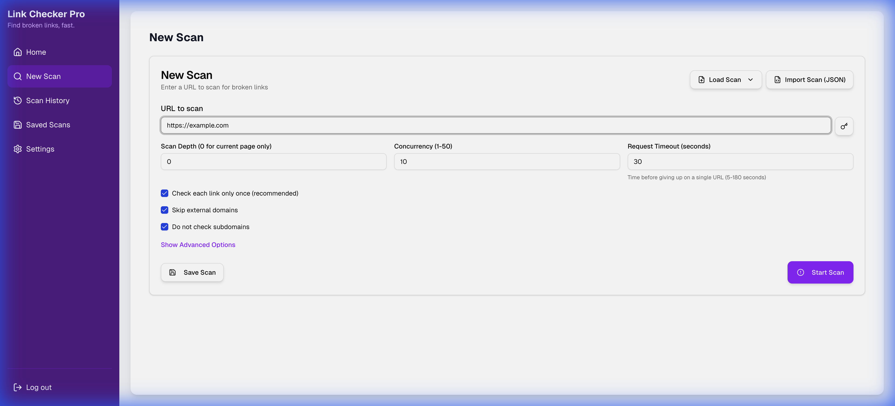

**Features:**
- **URL Input**: Enter the target website URL to scan
- **Scan Depth**: Configure how many levels deep the crawler should go (default: 2)
- **Concurrency**: Set the number of simultaneous requests (default: 5)
- **Request Timeout**: Configure timeout in seconds (default: 30)

**Route:** `/scan`

#### Advanced Options


**Advanced Configuration Includes:**
1. **URL Exclusions (Regex)**
   - Add multiple regex patterns to exclude matching URLs
   - Examples:
     - `\/assets\/.*\.pdf$` - Exclude PDF files in assets
     - `example\.com\/newsletter` - Skip newsletter URLs
     - `\/archive\/\d{4}/` - Exclude archive URLs with year patterns

2. **CSS Selector Exclusions**
   - Skip links within specific HTML elements
   - Examples:
     - `.footer` - Skip footer links
     - `#navigation` - Exclude navigation links
     - `[data-noindex]` - Skip elements with data-noindex attribute
     - `.sidebar, .ads` - Exclude multiple selectors

3. **Configuration Preview**
   - View current scan configuration in JSON format
   - Real-time updates as you modify settings

4. **Authentication Support**
   - Configure HTTP authentication if needed
   - Support for protected websites

#### Scan Management
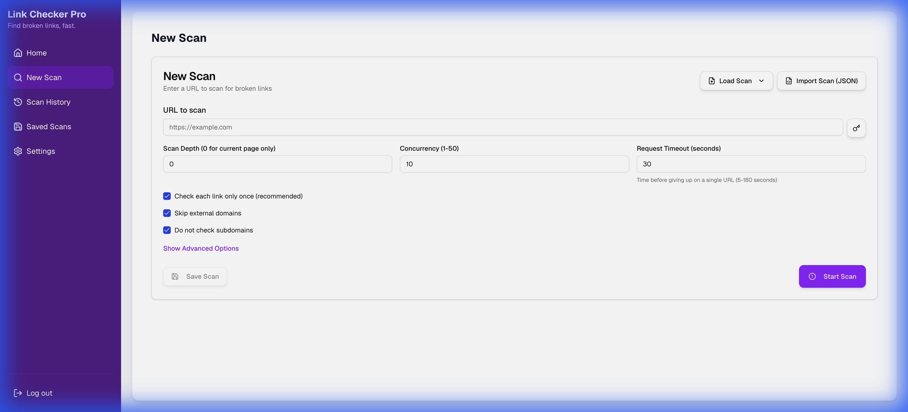
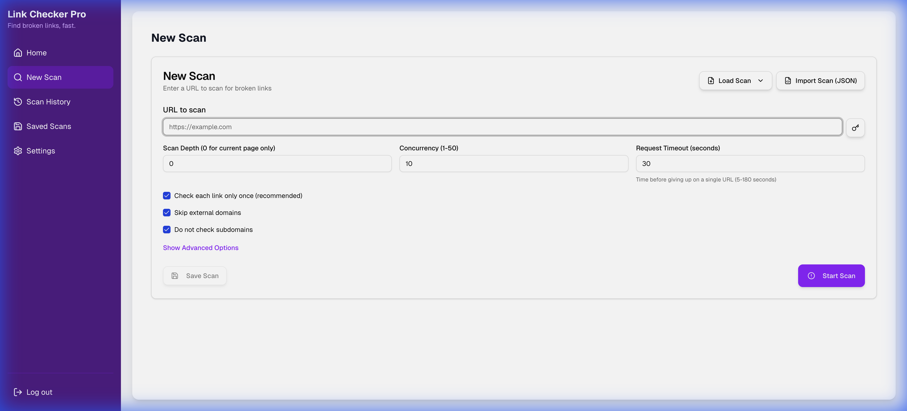

**Management Features:**
- **Save Scan**: Save current configuration with a custom name
- **Load Scan**: Load previously saved configurations via dialog
- **Import Scan**: Import scan configurations from JSON files
- **Edit Scan**: Modify existing saved configurations

#### Scan Execution
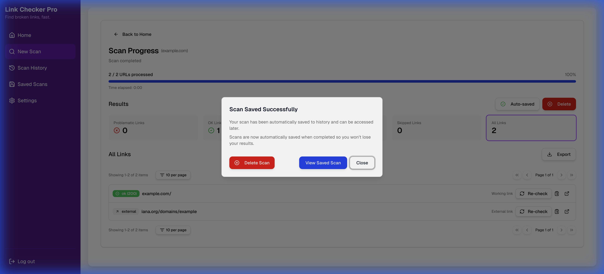

**Execution Process:**
1. User clicks "Start Scan"
2. Confirmation dialog appears
3. Scan begins with real-time progress updates
4. Results display upon completion
5. Auto-save to scan history

**Results Display:**
- Total URLs scanned
- Link status breakdown (OK, Broken, External, Skipped)
- Scan duration
- Detailed link list with status indicators

---

### 3. **Saved Scans Management**

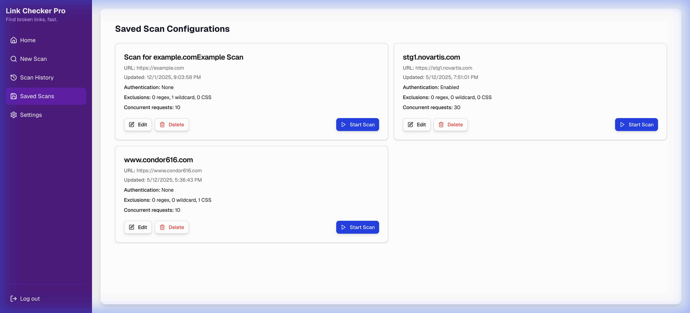
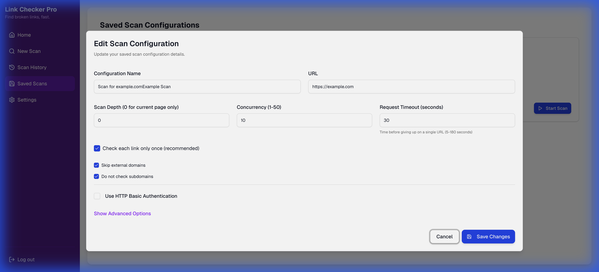

**Route:** `/saved-scans`

**Features:**
- View all saved scan configurations
- Each saved scan displays:
  - Configuration name
  - Target URL
  - Action buttons (Edit, Delete, Start Scan)

**Actions Available:**
1. **Edit**: Opens the scan page with pre-filled configuration
2. **Delete**: Removes the saved configuration
3. **Start Scan**: Immediately begins a scan with the saved settings

**Use Cases:**
- Recurring scans of the same website
- Different scan profiles for different projects
- Quick access to frequently used configurations

---

### 4. **Scan History**


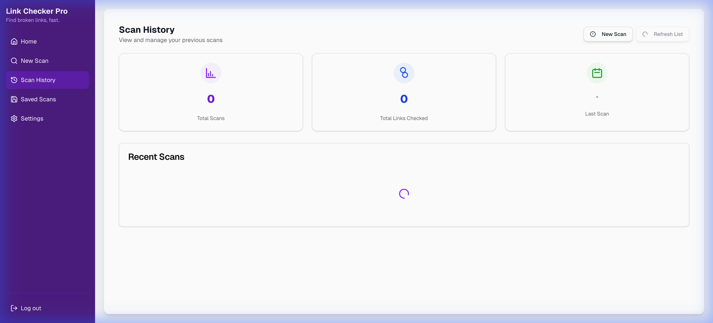

**Route:** `/history`

**Features:**
- Chronological list of all completed scans
- Each entry shows:
  - Target URL
  - Scan date/time
  - Scan ID
  - View button to see detailed results

**Functionality:**
- Automatic saving of all completed scans
- Persistent storage (file-based or Supabase)
- Quick access to historical scan data

#### Scan Detail View
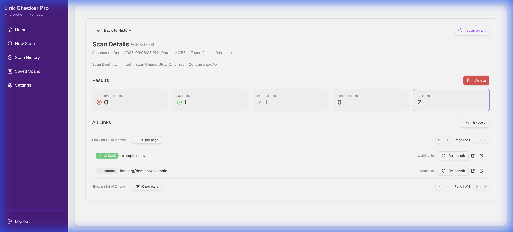

**Route:** `/history/[scanId]`

**Detailed Information:**
- Scan summary statistics
- Complete list of scanned URLs
- Link status for each URL
- Source page information
- HTTP status codes
- Error messages for broken links

#### Result Filtering
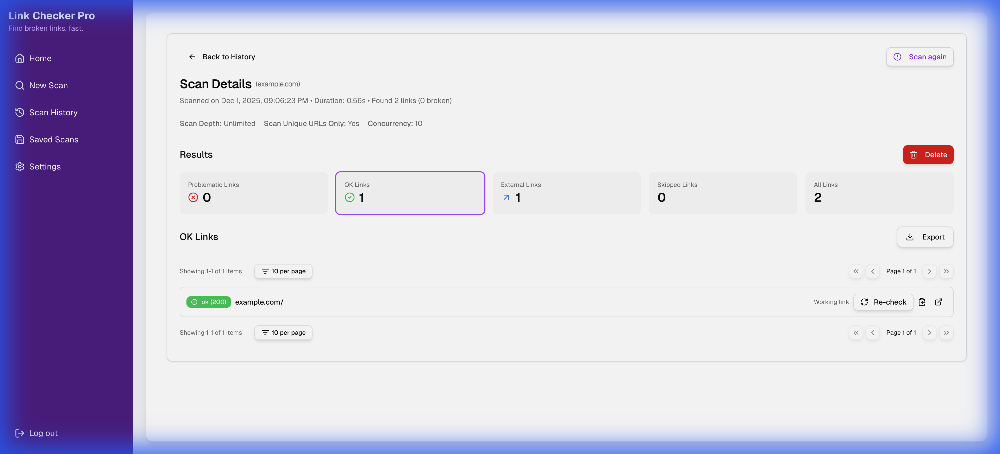
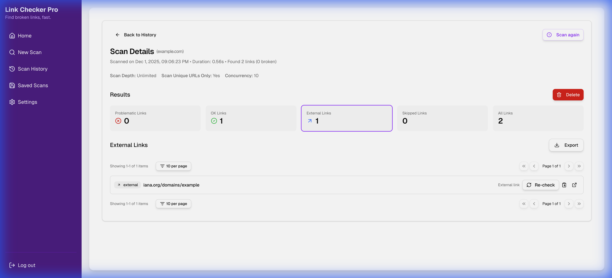

**Filter Options:**
1. **Problematic Links**: Shows only broken or error links
2. **OK Links**: Displays successfully validated links (200 status)
3. **External Links**: Shows links pointing to external domains
4. **Skipped Links**: Links excluded by regex or CSS selectors
5. **All Links**: Complete unfiltered list

**Benefits:**
- Quick identification of issues
- Focus on specific link types
- Efficient result analysis

#### Export Functionality
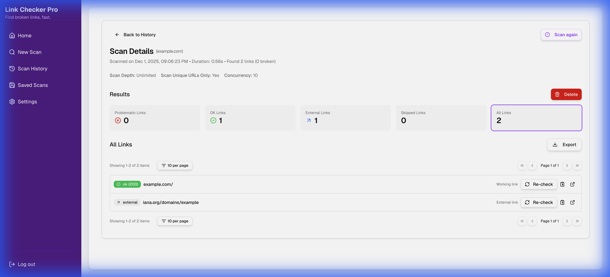

**Export Formats:**
1. **JSON**: Machine-readable format for integration
2. **CSV**: Spreadsheet-compatible format
3. **HTML**: Formatted report for sharing

**Use Cases:**
- Integration with other tools
- Reporting to stakeholders
- Archival purposes
- Further data analysis

---

### 5. **Settings & Configuration**


**Route:** `/settings`

#### Storage Configuration

**Storage Type Selection:**
1. **File-based Storage** (Default)
   - Stores data in local JSON files
   - Directories:
     - `.scan_configs` - Saved scan configurations
     - `.scan_history` - Scan results
     - `.scan_params` - Scan parameters
   - No external dependencies
   - Suitable for local/Docker deployments

2. **Supabase Database**
   - Cloud-based PostgreSQL storage
   - Requires Supabase account
   - Configuration options:
     - Project URL
     - Anonymous Key
   - Schema initialization button
   - Data management tools

**Switching Between Storage Types:**
- Can switch at any time
- Data preserved in both systems
- No data loss when switching

#### Supabase Management
- **Initialize/Reset Schema**: Set up database tables
- **Check Table Status**: Verify database connection
- **Clear Data**: Remove all stored data
- **Delete Tables**: Complete database cleanup

---

## Technical Architecture

### Frontend Stack
- **Framework**: Next.js 15.3.1 (React 19)
- **Language**: TypeScript
- **Styling**: Tailwind CSS v4
- **UI Components**: Radix UI
- **Animations**: Framer Motion
- **Notifications**: Sonner (toast notifications)
- **Theme**: next-themes (dark mode support)

### Backend Stack
- **Runtime**: Node.js 18+
- **API**: Next.js API Routes
- **HTML Parsing**: Cheerio
- **Concurrency Control**: p-limit
- **Database**: Supabase (optional)

### Key Dependencies
```json
{
  "next": "15.3.1",
  "react": "^19.0.0",
  "typescript": "^5",
  "tailwindcss": "^4",
  "cheerio": "^1.0.0",
  "@supabase/supabase-js": "^2.49.4",
  "framer-motion": "^12.9.4",
  "radix-ui": "various components"
}
```

---

## User Workflows

### Workflow 1: First-Time Scan
1. Navigate to `/scan`
2. Enter target URL
3. (Optional) Adjust scan depth and concurrency
4. Click "Start Scan"
5. Confirm in dialog
6. Wait for scan completion
7. Review results
8. (Optional) Export results
9. Scan auto-saved to history

### Workflow 2: Recurring Scan with Saved Configuration
1. Navigate to `/scan`
2. Configure scan with advanced options
3. Click "Save Scan"
4. Enter configuration name
5. Save configuration
6. Later: Go to `/saved-scans`
7. Click "Start Scan" on saved configuration
8. Scan runs with saved settings

### Workflow 3: Analyzing Historical Data
1. Navigate to `/history`
2. Browse past scans
3. Click "View" on a scan
4. Use filters to focus on specific link types
5. Export results if needed
6. Compare with other scans

### Workflow 4: Setting Up Supabase Storage
1. Create Supabase project
2. Get project URL and anon key
3. Navigate to `/settings`
4. Select "Supabase Database" from dropdown
5. Enter credentials
6. Click "Initialize/Reset Supabase Schema"
7. Verify connection with "Check Table Status"
8. All future scans saved to Supabase

---

## API Endpoints

### Scan Operations
- **POST `/api/scan`**: Execute a new scan
- **GET `/api/last-scan`**: Retrieve most recent scan
- **POST `/api/recheck`**: Re-scan specific URLs

### Configuration Management
- **GET `/api/saved-configs`**: List all saved configurations
- **POST `/api/save-scan`**: Save a new configuration
- **DELETE `/api/delete-scan`**: Remove a saved configuration
- **GET `/api/scan-params`**: Get scan parameters
- **POST `/api/save-scan-params`**: Save scan parameters

### History Management
- **GET `/api/history`**: List all scan history
- **GET `/api/history/[scanId]`**: Get specific scan details

### Settings & Storage
- **GET `/api/settings`**: Get application settings
- **POST `/api/settings`**: Update application settings
- **POST `/api/supabase/setup-sql`**: Initialize Supabase schema
- **GET `/api/supabase/check-table`**: Verify Supabase connection
- **POST `/api/supabase/clear-data`**: Clear Supabase data
- **DELETE `/api/supabase/delete-tables`**: Remove Supabase tables

---

## Storage System

### File-Based Storage Structure
```
.scan_configs/
  ├── config_1.json
  ├── config_2.json
  └── ...

.scan_history/
  ├── scan_1234567890_abc123.json
  ├── scan_1234567891_def456.json
  └── ...

.scan_params/
  └── params.json

.app_settings.json
```

### Supabase Database Schema
Tables created when using Supabase:
- **scan_configs**: Saved scan configurations
- **scan_history**: Historical scan results
- **scan_params**: Scan parameters and settings

### Data Persistence
- **Docker Support**: Volume mounts for persistent storage
- **Environment Variables**: Support for Supabase credentials
- **Configuration File**: `.app_settings.json` for app-level settings

---

## Screenshots Reference

### Navigation & Core Pages
1. **Home Page**: `images/home_page.png`
2. **Scan Page**: `images/scan_page.png`
3. **History Page**: `images/history_page.png`
4. **Saved Scans**: `images/saved_scans_page.png`
5. **Settings**: `images/settings_page.png`

### Scan Configuration
6. **Scan Form Defaults**: `images/scan_form_defaults.png`
7. **Advanced Options**: `images/scan_page_advanced.png`
8. **Load Scan Dialog**: `images/load_scan_dialog.png`
9. **Scan Form Loaded**: `images/scan_form_loaded.png`

### Results & Analysis
10. **Scan Results**: `images/scan_results.png`
11. **Scan Detail Page**: `images/scan_detail_page.png`
12. **OK Links Filter**: `images/scan_detail_ok_filter.png`
13. **External Links Filter**: `images/scan_detail_external_filter.png`
14. **Export Options**: `images/scan_detail_export_options.png`

### Management
15. **Saved Scans List**: `images/saved_scans_list.png`
16. **Edit Saved Scan**: `images/edit_saved_scan.png`
17. **History with Scan**: `images/history_page_with_scan.png`
18. **Storage Options**: `images/settings_storage_options.png`

---

## Additional Features

### UI/UX Enhancements
- **Dark Mode**: Full dark mode support via next-themes
- **Animations**: Smooth transitions with Framer Motion
- **Responsive Design**: Works on desktop, tablet, and mobile
- **Toast Notifications**: Real-time feedback with Sonner
- **Loading States**: Progress indicators during scans
- **Error Handling**: Graceful error messages and recovery

### Performance Features
- **Concurrent Requests**: Configurable parallel request handling
- **Request Timeout**: Prevents hanging on slow servers
- **Efficient Crawling**: Smart URL deduplication
- **Depth Control**: Prevents excessive crawling

### Developer Features
- **TypeScript**: Full type safety
- **ESLint**: Code quality enforcement
- **Docker Support**: Containerization for deployment
- **Environment Variables**: Flexible configuration
- **API Documentation**: Clear endpoint structure

---

## Deployment Options

### Local Development
```bash
npm install
npm run dev
```

### Production Build
```bash
npm run build
npm start
```

### Docker Deployment
```bash
docker build -t link-checker .
docker run -p 3000:3000 link-checker
```

### Docker with Persistent Storage
```bash
docker run -p 3000:3000 \
  -v $(pwd)/scan_history:/app/.scan_history \
  -v $(pwd)/scan_configs:/app/.scan_configs \
  -v $(pwd)/scan_params:/app/.scan_params \
  -v $(pwd)/app_settings.json:/app/.app_settings.json \
  link-checker
```

### Docker with Supabase
```bash
docker run -p 3000:3000 \
  -e NEXT_PUBLIC_SUPABASE_URL=https://your-project.supabase.co \
  -e NEXT_PUBLIC_SUPABASE_ANON_KEY=your-anon-key \
  link-checker
```

---

## Configuration Files

### `.app_settings.json`
```json
{
  "storageType": "file",
  "supabaseUrl": "",
  "supabaseKey": ""
}
```

### `.env.local` (Optional)
```
NEXT_PUBLIC_SUPABASE_URL=https://your-project.supabase.co
NEXT_PUBLIC_SUPABASE_ANON_KEY=your-anon-key
```

---

## Summary

Link Checker Pro is a feature-rich, production-ready application for website link validation. It combines:
- **Powerful scanning capabilities** with configurable depth and concurrency
- **Flexible storage options** supporting both local and cloud storage
- **Comprehensive result analysis** with filtering and export options
- **User-friendly interface** with modern design and dark mode
- **Robust architecture** built on Next.js and TypeScript
- **Deployment flexibility** with Docker support

The application is suitable for:
- Web developers maintaining websites
- QA teams performing link validation
- SEO professionals checking site health
- DevOps teams integrating into CI/CD pipelines
- Anyone needing reliable broken link detection
