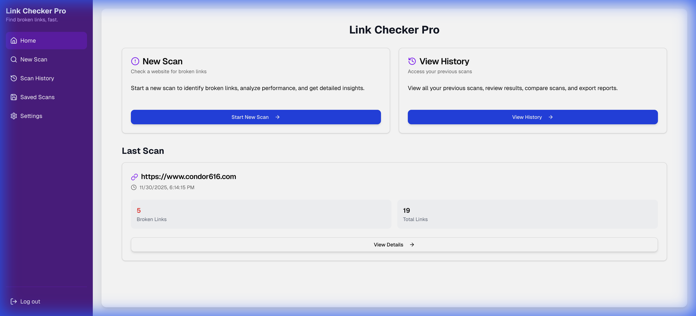
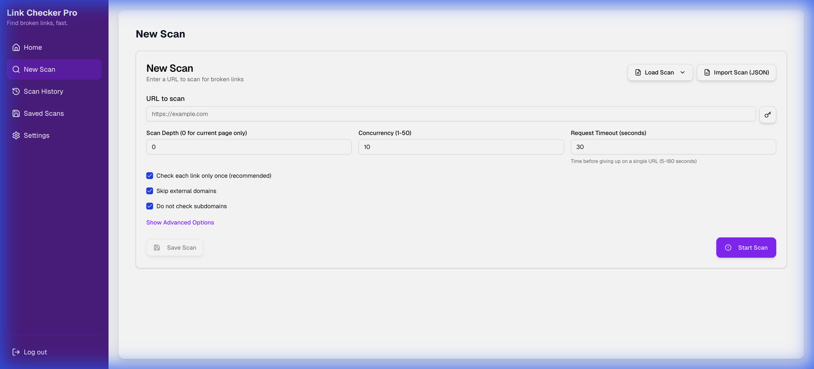
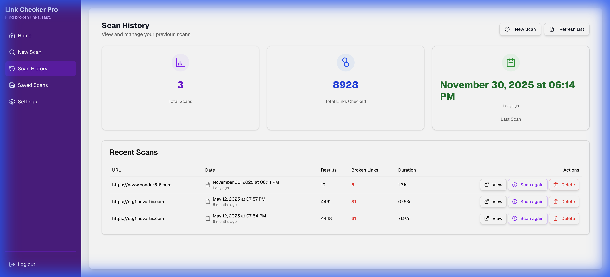
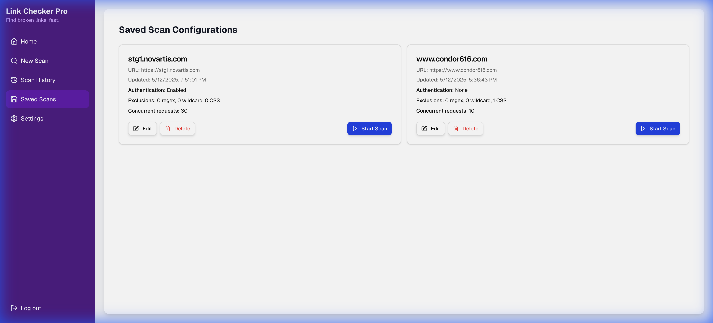
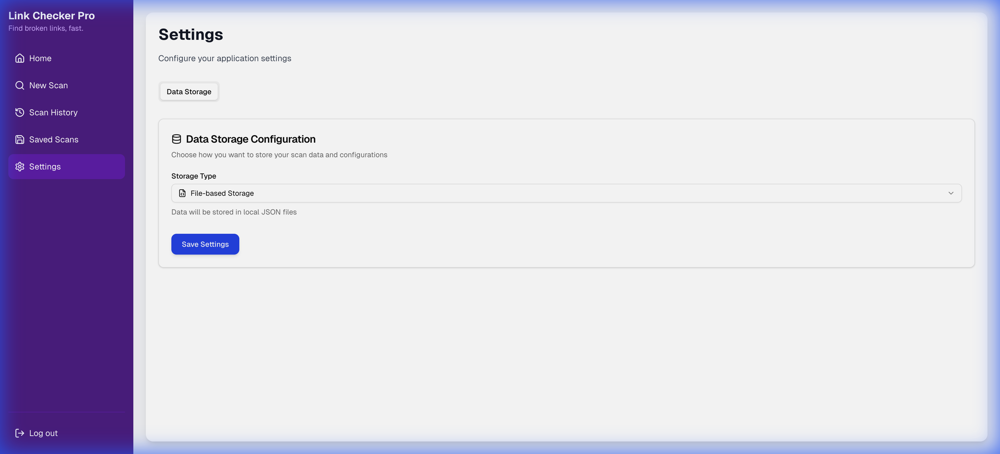
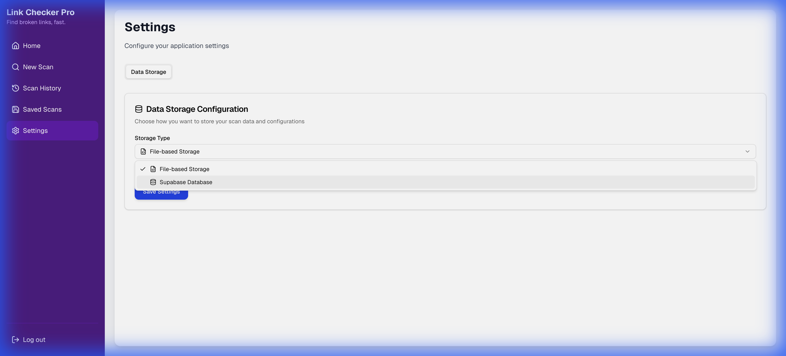

# Link Checker Pro - Feature List

## Overview
Link Checker Pro is a web application designed to crawl websites and check for broken links. It provides a user-friendly interface to manage scans, view history, and configure settings.

## Features

### 1. Dashboard (Home)
- **Overview**: Provides a landing page for the application.
- **Navigation**: Easy access to other sections like Scan, History, Saved Scans, and Settings.
- **Screenshot**: 

### 2. New Scan
- **Functionality**: Allows users to initiate a new link check.
- **Input**: Accepts a target URL to start crawling.
- **Advanced Options**:
    - **Exclusions**: URL patterns, Regex, and CSS selectors to exclude from the crawl.
    - **Configuration**: View current scan configuration in JSON format.
- **Management**:
    - **Save Scan**: Ability to save the current scan configuration with a custom name.
    - **Load Scan**: Load previously saved configurations.
    - **Import**: Import scan configurations from JSON.
- **Screenshots**:
    - 
    - 

### 3. Scan History
- **Functionality**: Displays a log of previously performed scans.
- **Details**: Users can likely view details of individual scans (supported by `/history/[scanId]` route).
- **Screenshot**: 

### 4. Saved Scans
- **Functionality**: Allows users to save scan configurations for quick reuse.
- **Management**: View and manage saved scan profiles.
- **Screenshot**: 

### 5. Settings
- **Functionality**: Configuration of application parameters.
- **Data Storage**:
    - **Options**: Choice between "File-based Storage" and "Supabase Database".
    - **Implication**: Users can choose where their scan history and configurations are saved.
- **Integrations**: Supabase integration is explicitly supported.
- **Data Management**: Options to clear data or manage tables.
- **Screenshots**:
    - 
    - 

## Technical Stack
- **Frontend**: Next.js (React)
- **Styling**: Tailwind CSS
- **Backend**: Next.js API Routes
- **Database**: Supabase (inferred from dependencies and routes)

## Directory Structure
- `src/app`: Application routes and pages.
- `src/components`: Reusable UI components.
- `src/lib`: Utility functions and libraries.
